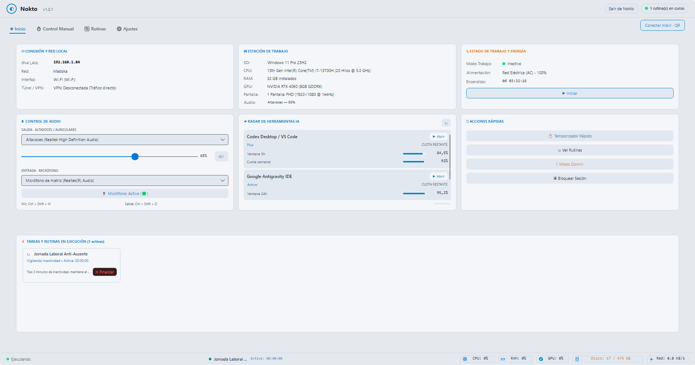
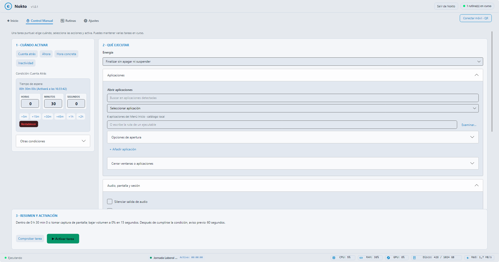
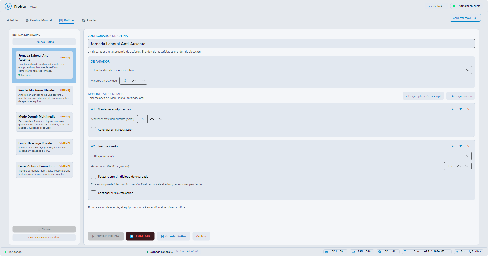
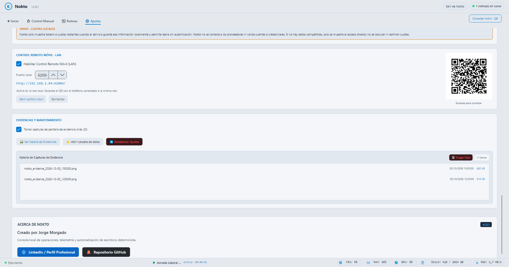
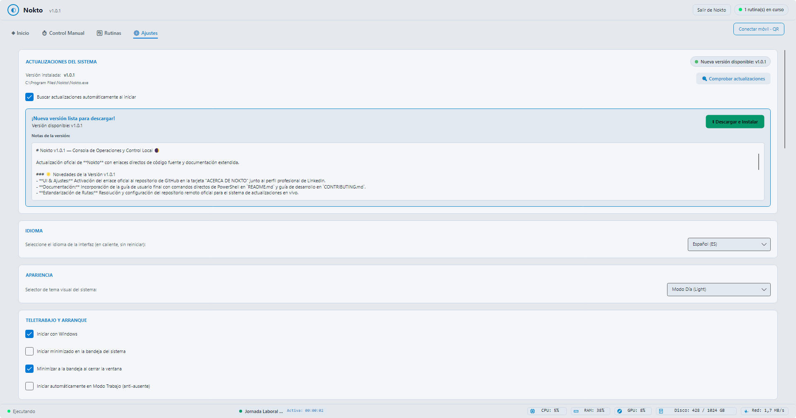
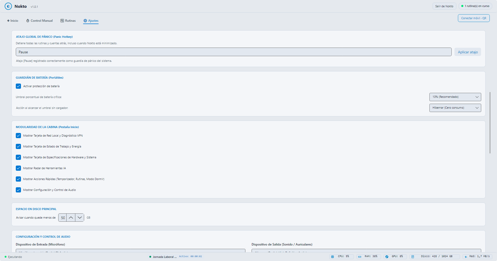
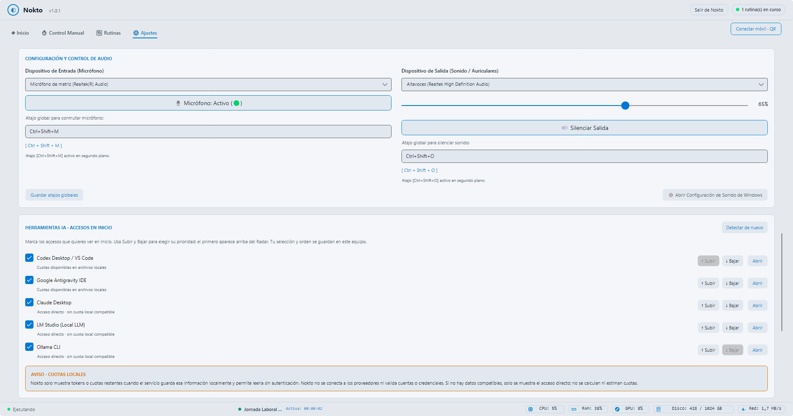

<p align="center">
  <b>🌐 Idioma:</b> &nbsp;
  <a href="README.md">English</a> &nbsp;|&nbsp;
  <b>Español</b>
</p>

# Nokto 🌒

> **Consola de Operaciones, Telemetría y Automatización de Escritorio Local**

[](https://github.com/jmorgadodev/Nokto/releases/latest)
[-0078D6)](https://github.com/jmorgadodev/Nokto)
[](https://dotnet.microsoft.com/)
[](LICENSE)
[-success)](https://github.com/jmorgadodev/Nokto)

**Nokto** es una consola de operaciones local para Windows diseñada para desarrolladores y estaciones de trabajo. Unifica en una sola cabina el monitoreo de telemetría de hardware en tiempo real, la gestión de audio y micrófonos de baja latencia (WASAPI), la orquestación de rutinas automatizadas concurrentes y el control remoto desde dispositivos móviles a través de tu red Wi-Fi local, con **cero dependencias en la nube y total respeto a la privacidad**.

<p align="center">
  
</p>

---

## ⚡ Instalación Rápida por Línea de Comandos (PowerShell)

Abre **PowerShell** y ejecuta el comando según tu preferencia de distribución:

### Opción A: Descargar y ejecutar la Versión Portable (Single-File)
Descarga el ejecutable autocontenido directamente en tu carpeta de descargas y lo inicia:
```powershell
irm https://github.com/jmorgadodev/Nokto/releases/latest/download/Nokto-Portable-x64.exe -OutFile "$HOME\Downloads\Nokto.exe"; Start-Process "$HOME\Downloads\Nokto.exe"
```

### Opción B: Instalación silenciosa desatendida (Windows Installer)
Descarga el instalador oficial y lo instala de fondo en el sistema sin cuadros de diálogo:
```powershell
$setup = "$env:TEMP\Nokto-Setup.exe"; irm https://github.com/jmorgadodev/Nokto/releases/latest/download/Nokto-Setup-x64.exe -OutFile $setup; Start-Process $setup -ArgumentList "/VERYSILENT /NORESTART" -Wait; Remove-Item $setup
```

---

## 📦 Descarga Manual Directa

| Formato | Enlace de Descarga | Descripción |
| :--- | :--- | :--- |
| **Portable (x64)** | [⬇ Nokto-Portable-x64.exe](https://github.com/jmorgadodev/Nokto/releases/latest/download/Nokto-Portable-x64.exe) | Ejecutable único (~65 MB). Cero instalación; ideal para pendrives o uso aislado. |
| **Instalador (x64)** | [⬇ Nokto-Setup-x64.exe](https://github.com/jmorgadodev/Nokto/releases/latest/download/Nokto-Setup-x64.exe) | Asistente de instalación estándar con accesos directos y desinstalador limpio. |

---

## 🛠 Características Principales

### 1. Cabina de Operaciones y Telemetría de Hardware
- **Métricas en tiempo real:** Supervisión pasiva de CPU (usuario/kernel), memoria RAM, GPU híbrida (NVIDIA + Intel Iris Xe) y tasa de transferencia de red sin impacto en rendimiento.
- **Control WASAPI de Audio y Micrófonos:** Conmutación instantánea de dispositivos predeterminados, control maestro de volumen y silenciamiento de micrófono con atajos globales (`Ctrl+Shift+M` / `Ctrl+Shift+S`).
- **Radar de Herramientas IA:** Detección de entornos locales de desarrollo (Codex Desktop, Antigravity IDE, Claude, OpenCode) y monitoreo de cuotas locales en disco.

<p align="center">
  
</p>

### 2. Control Manual y Tareas Concurrentes
- **Temporización multivariable:** Lanzamiento de acciones por cuenta regresiva, hora fija o tras periodos de inactividad de periféricos.
- **Motor Concurrente:** Ejecuta múltiples temporizadores en paralelo sin bloqueos mutuos; cada tarea viva cuenta con su propia cápsula interactiva y botón de cancelación en tiempo real.
- **Aviso previo (Grace Overlay):** Alerta flotante personalizable en pantalla antes de ejecutar acciones críticas con opción de posponer o abortar.

<p align="center">
  
</p>

### 3. Configurador de Rutinas (Pipeline Secuencial)
- **Constructor de Flujos:** Diseña secuencias lineales sin pasos obligatorios: arrancar herramientas de trabajo, reconfigurar audio, pausar medios, apagar pantallas o hibernar.
- **Catálogo Visual de Aplicaciones:** Detección automática de los accesos directos del Menú Inicio de Windows con extracción de iconos oficiales en resolución nativa.
- **Disparadores ampliados:** Ejecución al cerrar o abrir procesos específicos, horarios fijos por días de la semana, umbrales de inactividad o tráfico de red (fin de descargas).

<p align="center">
  
</p>

### 4. Control Remoto Móvil LAN y Galería de Evidencias
- **Microservidor HTTP Embebido:** Servidor ultraligero que opera estrictamente dentro de tu subred privada (ej. `http://192.168.1.X:4884`).
- **Live Snapshot de Pantalla:** Captura el estado de tus pantallas bajo demanda o en modo auto-vigilancia directamente en tu teléfono móvil para supervisar renders o tareas largas.
- **Emparejamiento por QR:** Escanea el código QR nativo generado en la pantalla para abrir la interfaz táctil sin necesidad de instalar apps adicionales.
- **Galería de Auditoría de Evidencias:** Capturas de pantalla automáticas previas a la ejecución de rutinas críticas con visor integrado en la app.

<p align="center">
  
</p>

### 5. Ajustes del Sistema, Guardián de Batería y Priorización de IA
- **Actualizador Integrado y Temas Visuales:** Comprobación automática de versiones contra GitHub Releases con notas de versión, soporte Hot-Swap para la versión portable, cambio de idioma al vuelo (ES/EN) y temas ergonómicos Día/Noche.
- **Atajo Global de Pánico y Guardián de Batería:** Atajo configurable (`Pause`) para abortar tareas en caliente y protección inteligente de batería en portátiles (umbral del 10% con hibernación de cero consumo).
- **Control WASAPI y Gestor de Entornos IA:** Conmutador de entrada/salida de audio con atajos globales y ordenación por prioridad de herramientas de IA locales.

<p align="center">
  
</p>

<p align="center">
  
</p>

<p align="center">
  
</p>

---

## 🔒 Privacidad y Arquitectura
- **0% Telemetría Externa:** Nokto no realiza llamadas a servicios de analítica de terceros ni almacena datos en servidores externos.
- **Conexión Local Exclusiva:** El servidor móvil solo responde a peticiones originadas dentro de la red LAN (`192.168.x.x`, `10.x.x.x`, `127.0.0.1`).
- **Persistencia Aislada:** Las configuraciones se guardan localmente en formato JSON dentro del directorio de la aplicación (`data/`).

---

## 💻 Desarrollo y Compilación
Para instrucciones sobre cómo clonar el repositorio, ejecutar las pruebas y compilar los binarios localmente desde el código fuente, consulta el archivo [CONTRIBUTING.md](CONTRIBUTING.md).

---

## 👤 Autor
Desarrollado por **Jorge Morgado**  
- LinkedIn: [in/jorge-morgado](https://www.linkedin.com/in/jorge-morgado/)  
- GitHub: [@jmorgadodev](https://github.com/jmorgadodev)

---

## 📄 Licencia
Este proyecto está bajo la Licencia MIT. Consulta el archivo [LICENSE](LICENSE) para más detalles.
